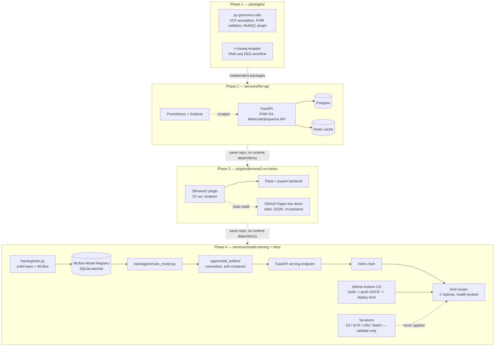

# GenomeRSE

[](https://github.com/NosakhareOsaro/Genome-RSE/actions/workflows/py-genomics-utils-ci.yml)
[](https://github.com/NosakhareOsaro/Genome-RSE/actions/workflows/r-rnaseq-wrapper-ci.yml)
[](https://github.com/NosakhareOsaro/Genome-RSE/actions/workflows/fhir-api-ci.yml)
[](https://github.com/NosakhareOsaro/Genome-RSE/actions/workflows/jbrowse2-sv-tracks-backend-ci.yml)
[](https://github.com/NosakhareOsaro/Genome-RSE/actions/workflows/jbrowse2-sv-tracks-plugin-ci.yml)
[](https://github.com/NosakhareOsaro/Genome-RSE/actions/workflows/jbrowse2-sv-tracks-pages.yml)
[](https://github.com/NosakhareOsaro/Genome-RSE/actions/workflows/model-serving-ci.yml)
[](https://github.com/NosakhareOsaro/Genome-RSE/actions/workflows/model-serving-cd.yml)

A research-software-engineering portfolio project spanning four phases —
packaging, an async API service, a genome-browser plugin, and an MLOps
Kubernetes stack — each fully tested, CI-checked, and (where a live
deployment target exists) actually verified against real infrastructure,
not just "the code looks right."

## Architecture



Each phase is independently deployable and independently tagged; later
phases don't import or depend on earlier ones at runtime. The arrows
between phase boxes above represent repository/portfolio sequencing,
not a data or service dependency.

## Repository layout

- `packages/` — installable libraries (Python, R)
- `services/` — deployable services (FastAPI FHIR API, FastAPI model-serving)
- `plugins/` — third-party tool integrations (a JBrowse2 plugin)
- `infra/` — infrastructure-as-code (Kubernetes manifests, Helm chart, Terraform)
- `docs/` — repository-wide documentation (Architecture Decision Records)

## Phases

- **Phase 1** (`v0.1.0-pypi-package`, done): two packages, each with its
  own test suite, CI workflow, docs, and packaging metadata:
  - [`packages/py-genomics-utils`](packages/py-genomics-utils) — a Python
    package with a VCF annotation helper, a minimal FHIR R4 resource
    validator, and a MultiQC plugin. PEP 621 packaging, pytest (100%
    coverage, gated at 90%), Sphinx/autodoc docs, pre-commit
    (black/ruff/isort/mypy), and CITATION.cff/.zenodo.json scaffolds.
  - [`packages/r-rnaseq-wrapper`](packages/r-rnaseq-wrapper) — an R package
    wrapping a basic RNA-seq differential expression workflow.
    roxygen2-documented, testthat suite (97.7% coverage via covr),
    pkgdown site config, and an R CMD check GitHub Actions workflow.

  Both packages use small, clearly-documented sample data (synthetic or
  official public spec examples — see each package's `tests/data/` or
  `inst/extdata/` provenance notes) and flag any simplified/non-conformance-
  grade scope directly in their docs.

- **Phase 2** (`v0.2.0-fhir-api`, done): [`services/fhir-api`](services/fhir-api) —
  an async FastAPI service exposing a FHIR R4 `MolecularSequence` REST
  API, with a self-contained demo OAuth2 Authorization Server (Authlib
  + joserfc; **not** a real EHR/IdP — see the service README's callout),
  async SQLAlchemy/asyncpg + Postgres, Redis cache-aside caching,
  slowapi rate limiting, Prometheus metrics with a provisioned Grafana
  dashboard, a pytest-asyncio suite (100% coverage, gated at 95%), a
  Locust load-test script, and a one-command `docker compose up --build`
  stack (verified end-to-end against real Postgres/Redis/Prometheus/
  Grafana). Deployment docs (AWS EC2 + Nginx + Let's Encrypt) are
  documentation-only — no live infrastructure is provisioned by this repo.

- **Phase 3** (`v0.3.0-jbrowse-plugin`, done): [`plugins/jbrowse2-sv-tracks`](plugins/jbrowse2-sv-tracks) —
  a JBrowse2 plugin rendering structural-variant arcs from VCF data
  (plain JavaScript, Rollup UMD bundle), backed by a small Flask +
  pysam REST API (`backend/`). Includes a Dockstore-compatible WDL
  workflow for preparing VCF/BAM data and a
  [live GitHub Pages demo](https://nosakhareosaro.github.io/Genome-RSE/jbrowse2-sv-tracks/)
  (static-JSON backed, no live server needed). Verified end-to-end
  against a real `@jbrowse/cli`-assembled jbrowse-web instance via
  Puppeteer — this caught four platform-specific bugs (JBrowseExports
  shape mismatches, a config-schema default collapse, and relative
  URLs breaking inside RPC workers) invisible to unit tests and the
  build alone; see the package README and `docs/blog-post.md` for the
  full writeup.

- **Phase 4** (`v1.0.0-mlops-stack`, done): [`services/model-serving`](services/model-serving) +
  [`infra/`](infra) — an MLOps Kubernetes stack around a demonstration
  splice-junction classifier (scikit-learn RandomForest over the UCI
  Molecular Biology splice-junction dataset, ~96% held-out accuracy on
  that small public benchmark — **explicitly not a production or
  clinical splice-site predictor**, see the service README). An MLflow
  (SQLite-backed) tracking + Model Registry pipeline trains and promotes
  a model version to a self-contained artifact the FastAPI serving app
  loads with no live-registry dependency at request time (see
  `docs/adr/0001-*.md`/`0003-*.md` for why). [`infra/k8s`](infra/k8s)
  (raw manifests) and [`infra/helm/model-serving`](infra/helm/model-serving)
  (a parametrized Helm chart) were both actually deployed to a real
  local `kind` cluster — not just `kubectl apply --dry-run` — with
  health-probed pods and real `/predict` responses verified through the
  cluster's own network. A GitHub Actions CD pipeline builds the image,
  pushes it to GHCR, and repeats that same kind/Helm deployment and
  validation inside CI. [`infra/terraform`](infra/terraform) provisions
  AWS S3/ECR/IAM/Batch as **infrastructure-as-code only** — validated
  with `terraform validate`, never applied, no AWS credentials anywhere
  in this repo. Three Architecture Decision Records in
  [`docs/adr`](docs/adr) cover the FastAPI, Kubernetes/Helm, and
  database/cache choices.

## Setup

Each phase is independent — clone the repo once, then set up whichever
component you want to run.

### Phase 1 — packages

```bash
cd packages/py-genomics-utils && pip install -e ".[dev]" && pytest
cd packages/r-rnaseq-wrapper && Rscript -e 'devtools::test()'
```

### Phase 2 — fhir-api

```bash
cd services/fhir-api
cp .env.example .env
docker compose up --build
# api: http://localhost:8000, prometheus: :9090, grafana: :3000
```

### Phase 3 — jbrowse2-sv-tracks

```bash
cd plugins/jbrowse2-sv-tracks/backend && pip install -e ".[dev]" && pytest
cd plugins/jbrowse2-sv-tracks/plugin && npm install && npm run build && npm test
```
Or just open the [live demo](https://nosakhareosaro.github.io/Genome-RSE/jbrowse2-sv-tracks/) — no setup needed.

### Phase 4 — model-serving + Kubernetes

```bash
# Run the API directly
cd services/model-serving
pip install -e ".[dev]" && pytest
uvicorn app.main:app --reload

# Or deploy to a local kind cluster (requires docker, kind, helm, kubectl)
docker build -t genomerse-model-serving:local services/model-serving
kind create cluster --name genomerse --config infra/k8s/kind-config.yaml
kind load docker-image genomerse-model-serving:local --name genomerse
helm install model-serving infra/helm/model-serving --namespace model-serving --create-namespace
kubectl -n model-serving wait --for=condition=available --timeout=120s deployment/model-serving
curl -X POST http://localhost:8080/predict -H "Content-Type: application/json" \
  -d '{"sequence": "CCAGCTGCATCACAGGAGGCCAGCGAGCAGGTCTGTTCCAAGGGCCTTCGAGCCAGTCTG"}'
```

## Target roles this demonstrates

- **Research software engineer / bioinformatics software engineer** —
  Phases 1 and 3: packaging real genomics tooling (VCF/FHIR/RNA-seq)
  with the testing, docs, and CI discipline of production software, and
  extending an existing scientific visualization platform (JBrowse2)
  through its real plugin architecture rather than forking it.
- **Backend / API engineer, healthcare-adjacent** — Phase 2: an async
  FastAPI service over a real healthcare data standard (FHIR R4),
  with auth, caching, rate limiting, and observability built and
  verified against real infrastructure, plus honest scope boundaries
  (a demo Authorization Server clearly marked as such, not oversold).
- **MLOps / ML platform engineer** — Phase 4: the full loop from a
  trained model through a registry, a containerized serving endpoint,
  and a Kubernetes deployment actually validated on a real cluster in
  CI, plus IaC for the cloud infrastructure a production version would
  run on.
- **DevOps / infrastructure engineer** — Phases 2 and 4 together:
  Docker Compose for a multi-service local stack where that's the right
  tool, Kubernetes/Helm/CD where the goal is to demonstrate
  orchestration, with an explicit ADR (`docs/adr/0002-*.md`) on why the
  tool changed between phases instead of picking one and using it
  everywhere by default.

Across all four phases, the throughline is treating verification as
non-optional: real containers instead of assumed environments, a real
browser instead of a passing unit test suite, a real local Kubernetes
cluster instead of manifests that merely parse. Several real bugs (see
each phase's own README/CHANGELOG entry) were only ever found this way —
including two that only surfaced on the *real* GitHub Actions runners,
after local verification had already passed: a coverage-measurement gap
in Phase 2's async ORM tests only reproducible on Linux (fixed by
configuring `coverage.py`'s `concurrency = ["greenlet"]`), and a Docker
tag rejected by GHCR in Phase 4's CD pipeline because
`github.repository_owner` isn't lowercase-normalized (see CHANGELOG.md
for both). Local, containerized, and CI-run verification each catch
different classes of bug — no one layer replaces the others.
