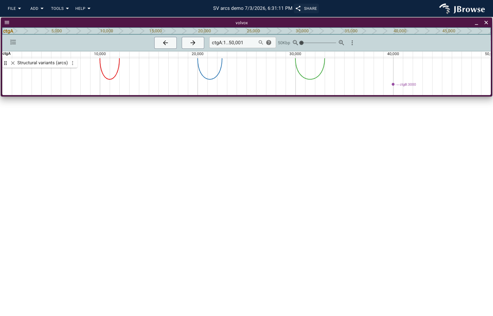

# Building a JBrowse2 structural-variant arc plugin (and the bugs only a real browser could find)

*Part of the GenomeRSE portfolio project, Phase 3.*

Structural variants — deletions, duplications, inversions, and
translocations — aren't well represented by the usual "box on a genome
browser track" glyph, because their defining feature is that they
connect *two* genomic positions rather than describing one contiguous
span. The natural visualization is an arc: draw a curve from breakpoint
A to breakpoint B, and let the shape of the arc (its span, its height,
its color) communicate the variant.

This post covers building [`jbrowse2-sv-tracks`](..), a small
[JBrowse2](https://jbrowse.org/jb2/) plugin that renders exactly that,
backed by a Flask API that parses SV records out of a VCF. The code
itself isn't especially large — an adapter, a renderer, ~330 lines of
JavaScript total — but getting it to actually work in a real browser
surfaced three separate platform-specific bugs that no amount of
passing unit tests or clean builds would have caught. That gap between
"the build succeeds" and "the plugin works" is the more interesting
story, so this post spends more time there than on the arc math itself.

## Architecture

```
Flask backend (pysam)  ──/api/svs?refName=&start=&end=──>  SvJsonAdapter
     parses a VCF's                                              │
     DEL/DUP/INV/BND                                              │ builds JBrowse
     records into JSON                                            │ Feature objects
                                                                   ▼
                                                          SvArcRenderer (SVG)
                                                          bezier arc, same contig
                                                          marker + label, cross-contig
```

Two components, two languages, one contract: a JSON array of records
shaped like

```json
{
  "id": "sv1_del",
  "refName": "ctgA", "start": 9999, "end": 10000,
  "mateRefName": "ctgA", "mateStart": 11999, "mateEnd": 12000,
  "svType": "DEL"
}
```

Every SV record — regardless of whether it's a VCF symbolic ALT
(`<DEL>`, `<DUP>`, `<INV>`, using the `END` INFO field) or a genuine
breakend pair (`ALT` like `N[chr2:500[`) — gets normalized into "this
breakpoint, that breakpoint." For DEL/DUP/INV, "that breakpoint" is
just the variant's own end coordinate, so the arc spans the event
itself. For BND, it's the linked mate, which can be on a different
contig entirely. One schema, one renderer, both cases handled — the
renderer decides what to *draw* per-record, but doesn't need two
separate feature shapes to reason about.

One real gotcha on the backend side: VCF's `END` INFO field is
special-cased by htslib/pysam. It's *not* in `record.info` — it's
exposed via `record.stop`. Using `record.info.get("END")` silently
returns `None` for every symbolic-ALT record, which is a quiet failure
mode (no exception, just wrong data) that only showed up because the
test suite asserted exact expected values from real sample data rather
than just "the function doesn't crash."

## The rendering approach

JBrowse2 already ships an official `arc` plugin
(`plugins/arc` in [GMOD/jbrowse-components](https://github.com/GMOD/jbrowse-components)),
and its `ArcRendering.tsx` is the reference this plugin's renderer is
modeled on: a `FeatureRendererType` whose React component draws one
`<path>` per feature, with `d="M left 0 C left h, right h, right 0"` —
a cubic bezier that starts and ends at `y=0` and peaks at `y=h`. No
canvas, no WebGL, just SVG path strings computed from `bpToPx`/`bpSpanPx`
(the same coordinate-conversion utilities JBrowse's own renderers use).

The one thing the official arc renderer *doesn't* need to handle:
arcs whose two ends are on different reference sequences. A single
`LinearGenomeView` can only show one coordinate space at a time, so
there's no way to draw a literal arc from `ctgA:40000` to `ctgB:3000` —
you'd need a comparative/synteny view for that, which is a different
tool for a different job. This plugin's renderer checks
`feature.refName === feature.mateRefName`: same contig, draw the arc;
different contig, draw a small marker at the feature's own position
with a text label pointing at where the mate is
(`→ ctgB:3000`). That's a real scope boundary, not a missing feature —
worth being explicit about it in the code and in this write-up rather
than letting a reader assume cross-contig arcs "should" work and
wonder why they don't.

## Reusing the *right* JBrowse2 base classes turned out to be the hard part

The original plan was to build a custom Track and Display type,
mirroring the official arc plugin's `LinearArcDisplay`. That plugin
imports `BaseLinearDisplay`/`BaseLinearDisplayComponent` from
`@jbrowse/plugin-linear-genome-view` — but it can do that because it's
compiled *into* jbrowse-web itself. An external plugin, loaded at
runtime as a UMD `<script>` tag, doesn't get to import from arbitrary
other JBrowse packages: it can only use whatever JBrowse explicitly
re-exports on `window.JBrowseExports` (the list lives at
`@jbrowse/core/ReExports/list`), and `@jbrowse/plugin-linear-genome-view`
isn't on it. Calling `jbrequire` for a package that isn't in that list
throws immediately, in plain language: *"If this package must be
shared between plugins, add it to ReExports.js."*

That's a real, load-bearing platform constraint, and it simplified the
plugin a lot once identified: skip the custom Display entirely, and
attach a custom **renderer** to JBrowse's existing, built-in
`FeatureTrack` + `LinearBasicDisplay` via config
(`"displays": [{"type": "LinearBasicDisplay", "renderer": {"type": "SvArcRenderer"}}]`).
Renderer and adapter classes *are* meant to be swapped in from outside
— that's the intended extension point — so this plugin only needed to
register two pluggable elements, not four.

## Three bugs a passing test suite and a clean build both missed

Unit tests (vitest, React Testing Library, a real `@jbrowse/core`
`PluginManager` instance) all passed. `rollup -c` produced a clean UMD
bundle. And the plugin still didn't work the first time it was loaded
in an actual jbrowse-web instance. Here's why, in the order they were
found — each one only surfaced by assembling a real jbrowse-web via
`@jbrowse/cli`, loading the built plugin in headless Chromium via
Puppeteer, and inspecting the actual rendered DOM.

### 1. A default import that's only "default" some of the time

```js
import FeatureRendererType from '@jbrowse/core/pluggableElementTypes/renderers/FeatureRendererType'
class SvArcRenderer extends FeatureRendererType {}
```

This throws `Class extends value #<Object> is not a constructor or
null` — but only in the browser, never in a unit test. Against the
local `@jbrowse/core` npm package, a default import correctly unwraps
to the class (normal ESM interop). But `window.JBrowseExports` — the
object rollup's `externalGlobals` plugin substitutes for these imports
at runtime — wraps *this specific module* as `{ default:
FeatureRendererType }`, not the bare class. Other modules, like
`@jbrowse/core/Plugin`, get unwrapped to the bare class by JBrowse's
own re-export generation. There's no way to know which behavior a
given module has without checking; the fix is a defensive namespace
import:

```js
import * as FeatureRendererTypeModule from '@jbrowse/core/pluggableElementTypes/renderers/FeatureRendererType'
const FeatureRendererType = FeatureRendererTypeModule.default ?? FeatureRendererTypeModule
```

This resolves correctly in both contexts, since a namespace import
never gets auto-unwrapped either way.

### 2. A real subpath that doesn't exist at runtime

`@jbrowse/core/util/simpleFeature` resolves fine locally — it's a real
file in the npm package. It's not, however, one of the paths JBrowse
re-exports for external plugins; at runtime it's `undefined`.
`SimpleFeature` is available from the `@jbrowse/core/util` barrel
instead, which *is* on the re-export list. Nothing about this is
visible from source code alone — it's purely a property of which
subpaths JBrowse's build script decided to expose, and that list isn't
something a type checker or a local test run can validate against.

### 3. A config default that collided with real usage

This one produced the most confusing symptom: `Error: could not
determine adapter type from adapter config snapshot {}`. Not a crash —
a normal-looking track error, as if the adapter type name itself was
wrong, even though `pluginManager.getAdapterType('SvJsonAdapter')`
clearly returned a real, correctly-registered adapter type.

The actual cause lives in `@jbrowse/core`'s `ConfigurationSchema`.
Every config schema gets a `postProcessSnapshot` hook that compares the
current snapshot against a freshly-created "all defaults" instance of
the same schema — and if *every* value matches its default, the whole
snapshot collapses to `{}`, dropping even the `type` discriminator
field. It's a genuinely reasonable compaction: a config that's 100%
default is equivalent to `{}`, so why store more than that? The
problem was that this plugin's `SvJsonAdapter` config schema set
`svEndpoint`'s default to `http://localhost:5000/api/svs` — a real,
working URL — and the demo configs set `svEndpoint` to *that exact same
value*. From JBrowse's point of view, the config was indistinguishable
from "nothing configured," so it collapsed, and `readConfObject`
downstream got `{}` instead of `{type: "SvJsonAdapter", svEndpoint:
"..."}`.

Every built-in JBrowse adapter avoids this by using an obviously
nonfunctional placeholder as its default — `BedAdapter`'s
`bedLocation` defaults to `/path/to/my.bed.gz`, not a real file
anyone would actually point at. That convention isn't just style; it's
load-bearing. The fix here was the same: `svEndpoint`'s default became
`/path/to/sv-tracks-backend/api/svs`, and a regression test
(`test/configSchema.test.js`) now constructs the schema with realistic
values and asserts `type` survives the snapshot, specifically to catch
this class of bug without needing a browser.

### A fourth, related one: relative URLs and web workers

Once the plugin rendered correctly against `http://localhost` URLs,
the GitHub Pages demo (which has no backend — everything has to be a
static file) failed the same way with a 404, even though the exact
same relative path worked fine for the plugin's own `<script src="./plugin.js">`
tag. The difference: `FeatureRendererType` runs through JBrowse's RPC
system, which may execute in a web worker depending on the configured
RPC driver. A relative URL fetched from inside a worker resolves
against *the worker script's own location*, not the page's — so
`./sv-demo.json` might resolve to something like
`/static/js/sv-demo.json`, which doesn't exist. Script tags don't have
this problem because they're always resolved by the browser against
the page's own URL, regardless of any worker involved later. The fix
was mechanical once understood: every URL an adapter or renderer
fetches at runtime (`fastaLocation`, `faiLocation`, `svEndpoint`) has
to be absolute. The GitHub Actions deploy workflow substitutes a
`__PAGES_BASE_URL__` placeholder with the real deployed URL before
publishing, specifically so the demo config never has to guess.

## Why the WDL/Dockstore piece exists

Real SV-calling pipelines produce a VCF and a BAM that both need to be
coordinate-sorted and indexed before any genome browser can serve them
efficiently. `workflow/prepare_sv_track_data.wdl` is a small,
Dockstore-compatible (see the repo-root `.dockstore.yml`) WDL workflow
that does exactly that with `bcftools`/`samtools` in public containers
— the same preprocessing step a real pipeline would run before handing
data to something like `sv-tracks-backend`. It's not registered live
on dockstore.org, but it *is* actually runnable — verified with
`miniwdl run` against this repo's own sample data, which caught one
more small bug: the first version called the standalone `tabix`
binary, which the `staphb/bcftools` image doesn't ship; `bcftools index
--tbi` builds the same index without it.

## The throughline

Every one of these bugs shares a property: they're invisible to a
tool that only ever imports the real npm package or only ever checks
"did the build succeed." They only exist at the boundary between this
plugin's code and the specific runtime it's loaded into — a boundary
that a unit test, by construction, doesn't cross. That's the concrete
argument for treating "assemble the real host application, load the
real build artifact, and look at the real rendered output" as a
required verification step for this category of software, not an
optional nice-to-have on top of a green test suite.


